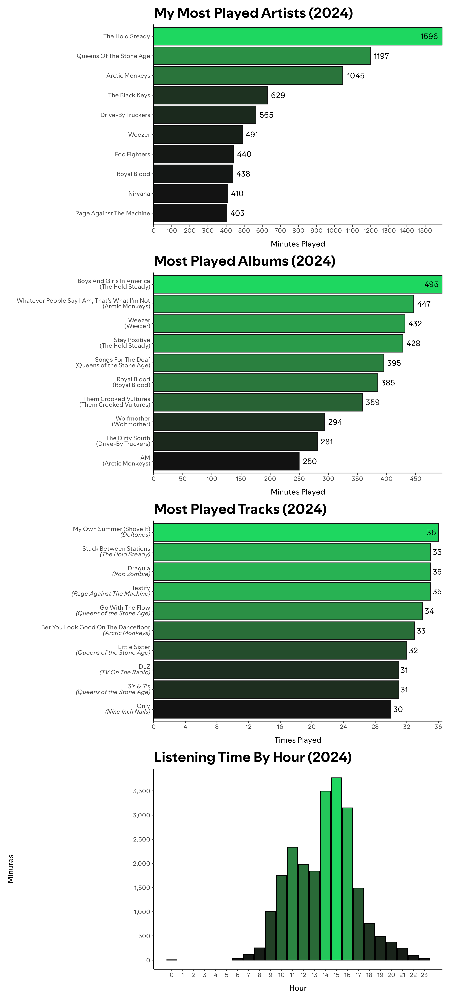

<!-- README.md is generated from README.Rmd. Please edit that file -->

# rewrapped

Rewrapped is an open-source analysis of your Spotify listening history.
By reading our own streaming history files we can get a more
comprehensive view of listening habits than the one provided in the
official yearly Wrapped summary.

- Most listened to artists, albums, and tracks
- 

## Own Your Data

Spotify users can request a copy of their personal data from their
[account privacy settings](https://www.spotify.com/us/account/privacy/).
See the [Understanding my
data](https://support.spotify.com/us/article/understanding-my-data/)
page for more information.

> When you use the automated Download your data tool, you will receive
> several files in JSON format… You may download three different
> packages of data, either separately or all at once.

To create our own “Wrapped” summary we need the streaming history files:

> A list of items (e.g. songs, videos, and podcasts) listened to or
> watched in the past year, including:
>
> - Date and time of when the stream ended in Coordinated Universal Time
>   format.
> - Name of “creator” for each stream (e.g. the artist name of a music
>   track).
> - Name of items listened to or watched (e.g. title of music track).
>   `msPlayed` - Stands for how many mili-seconds the track was listened
>   to.

# Analyze Your Data

The main R script in this repo will read the data and generate some
graphs.

``` r
source("rewrapped.R")
```


